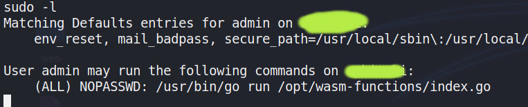

# PATH HİJACKİNG

Path hijaking is used to manipulate the directory where the program will run. Let's consider a python program like the one below. A python script that runs **job.sh** written in bash language. Of course, in the real scenario, this python script will be more complicated. For easy understanding, I will continue with python as an example.

```python
import os
os.system("./job.sh")
```

Let's see bash file **job.sh**

```bash
#!/bin/bash
a program that does everyday work on the server like cron.
<some dangerous code>
```

Bash scripts are often used on the server to shorten the duration of the processes and to automate the processes. Suppose that;

Let's see that when we run the \*\*sudo -l\*\* command, we can run the above python script with root privileges for our active user.

I can hear you saying I wish I could edit the job.sh file. In this case, we have to resort to path hijacking. Path hijacking changes the active path environment. In other words, it provides a manipulation as if I ran the program in the directory I want, not in the directory it is in. If I set my path to /tmp: the program will run any job.sh file in the /tmp directory.

Of course, although it is easy to explain, there are exceptions. Let's go through a machine on hackthebox together. Since the machine is active I will censor the machine name and ip address.





Here is a file called index.go that we can run with root privileges. Let's look at the source codes.


![[Pasted image 20210602162413.png]]

Running the deploy.sh file in it. I go to the /tmp directory and rewrite my own deploy.sh file to get a reverseshell.

![[Pasted image 20210602162600.png]]

![[Pasted image 20210602162821.png]]

I add a new directory to the path with Export. /tmp directory. So that it can read my deploy.sh even though my file is not in the same directory as it. Hijacking is done here.

![[Pasted image 20210602163644.png]]

![[Pasted image 20210602163615 1.png]]

PWNED!


